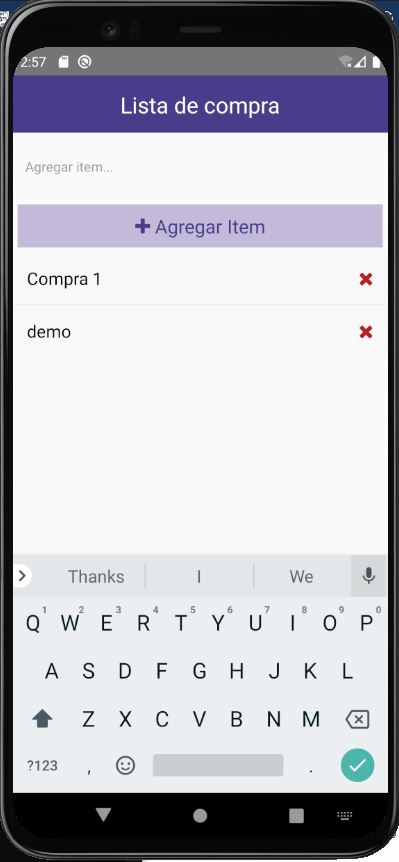

# Shopping List

Aplicación sencilla en React native para agregar elementos en una lista.

## Tech Stack

**App:** React-native

## Screenshots



## Ejecutar localmente

Clonar proyecto

```bash
  git clone https://github.com/kioshiokamoto/react-native-crash
```

Ir a ruta de proyecto

```bash
  cd react-native-crash
```

Instalar dependencias

```bash
  npm install
```

Iniciar app

```bash
  react-native run-android
```

### Referencia de proyecto:

Traversy Media
